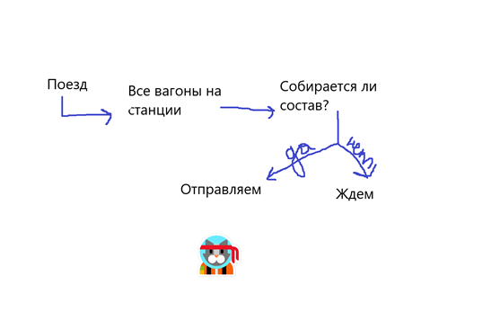

Состав команды:
1. Полежаева Валерия - ***scrum master***
2. Матасов Алексей
3. Айвазьян Вазген
4. Шумкова Виктория
5. Махнева Екатерина
6. Демьяновский Савелий
7. Ярославцев Владислав
8. Фельштын Станислав
9. Кайрано Святослав
10. Ковальцов Сергей

# TODO

|Number|Task|Priority|Difficulty|Responsible|Check|
|---|---|---|---|---|---|
|1|Сделать из карты городов граф и поддерживать его состояние|1|3|8,9||
|2|Прописать структуру данных (как будет храниться информация о вагонах, станции, поездах и т.д.) + сделать список грузов|1|2|2,3,10|x|
|3|Поиск вершины, в которую нужно отправить вагон, по его пункту назначения (function searchStation)|1|7|6,7||
|4|Формирование составов поездов|2|6|4,5||
|5|Сбор статистики|3|2|||
|6|Интерфейс|3|-|||
|7|Загрузка вагона, если он пустой, при наличии груза на станции|2|-|||
|8|Если приходит запрос на пустой вагон, то отправить его на эту станцию, при его наличии|3|-|||

## Task details

По разработке:
Когда приезжает вагон:

 
Начальные условия:
* На станции: набор локомотивов, набор пустых вагонов, набор грузов
 
* Структура:
    * Поезд: Локомотив + Вагоны
    * Вагон: Груз (тип, масса, пункт назначения) + Грузоподъемность (const) + Масса
    * Станция: Локомотивы + Список вагонов + Список грузов + Имя
    * Локомотив: Максимальное количество вагонов (const) + грузоподъемность (const)
    * Модель: дата, время, матрица смежности графа                 
 
 
* Статистка:
    * Куда отправился груз, какой груз и сколько (вагонов)
    * Дата прибытия груза и дата отправки
    * Дата и время прибытия вагонов, количество
 
 
* Интерфейс: Дата, за какое время нужен отчет, что посчитать. Нужно сделать рабочий стол для оператора станции.
 
* Загрузка вагона: если вагон пустой -> какие грузы есть на станции? ->   загрузить и отправить
 
* Запросы на пустые вагоны: Если есть запрос и нет груза, который можно отправить ->  отправить пустой вагон       
